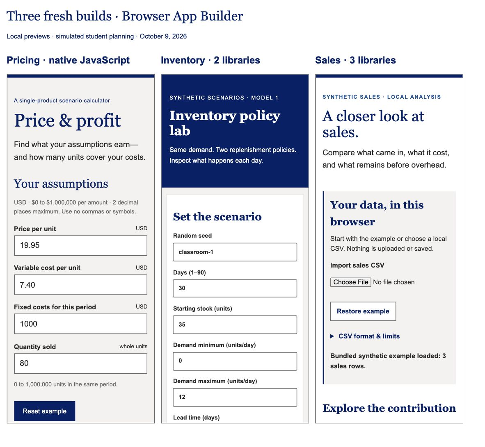

# Fresh Browser App Builder trials — October 9, 2026

Three independent subagents built the original pricing, inventory and sales examples from empty folders using Browser App Builder 0.2.0 frozen at commit `3966d48`. They received ordinary application briefs without prescribed libraries. The coordinator answered their planning questions as a simulated student. Each `TRIAL.md` retains the exchanges, selected skills and reasons for using or declining libraries. No previous application fixtures were copied; plugin starters and theme assets were allowed. The plugin remained unchanged.

| Application | Selected libraries and purpose | Browser checks | Evaluated commit |
| --- | --- | --- | --- |
| [Pricing](pricing/TRIAL.md) | None; native form and BigInt integer cents | 25/25 | `fba817d8e56a5eff79198cddeef960d4187844e2` |
| [Inventory](inventory/TRIAL.md) | seedrandom 3.0.5 for reproducible demand; ECharts 6.1.0 for stock trajectories | 14/14 | `445504c512ed6ea69e9c4eaa350db343cd85029c` |
| [Sales](sales/TRIAL.md) | Papa Parse 5.7.0 for CSV; Tabulator 6.6.1 for sortable rows; ECharts 6.1.0 for comparisons | 32/32 | `d5f8cff4f092a6da2a2336ecb3bf13833df422f6` |

The libraries are used by application imports and observed interactions, not merely listed in manifests. Both managed projects passed the frozen dependency checker. Runtime libraries are in dependencies; Vite 8.3.4 is the only development dependency. Existing Node 22.19.0/npm 10.9.3 were reused. Pricing requires no build runtime; its preview used the machine's existing Python, without installation or an application dependency. All three use the packaged Campus Designer guidance and canonical theme tokens.

Independent expected results were specified before implementation in [expected-cases.json](expected-cases.json). The coordinator separately exercised decimal/reset behavior, the four-day stock comparison, sales filtering/empty results/sorting and keyboard controls in production previews. Reports preserve fuller model, browser, packaging and layout checks. [coordinator-verification.json](coordinator-verification.json) records clean source/plan comparisons against evaluated commits, report-only final heads and absent remotes.

After independent review, seven confirmed inventory/sales defects were corrected and new regression groups added. The table now lists their latest evaluated checkpoints; pricing is unchanged. Original trial results and failed rounds remain in each EVALUATION.md and Git history. [Review corrections](review-corrections/README.md) records the seven fixes and verification.

## Failures and corrections

Pricing exposed a reset timing bug: a microtask recalculated before native form values reset. It now recalculates on the next animation frame. Enlarged narrow text overflow was also corrected. Sales currency totals wrapped awkwardly on narrow screens; labels and values now stack. Its first checkpoint passed 27/28 checks because a chart assertion incorrectly treated changed SVG paint order as changed color. The corrected assertion compares color sets; the failed round remains. A development notice path was corrected. Inventory's model cases passed; responsive helper widths and its random-generator isolation assertion were strengthened.

Vite occasionally served stale test modules after edits; restarting the affected test server resolved this. The default npm cache was sandbox-read-only, so installs used /private/tmp/bab-fresh-npm-cache. No permissions were bypassed. Production bundles still trigger size warnings: inventory approximately 536 kB, sales 979 kB minified JavaScript (sales approximately 283 kB gzip). Selected chart imports reduced sales from approximately 1.6 MB. These limitations remain disclosed.

## Inspect and reproduce

At handoff, production previews remain running for review:

- [Pricing](http://127.0.0.1:9312/fresh-pricing/)
- [Inventory](http://127.0.0.1:9322/fresh-inventory/)
- [Sales](http://127.0.0.1:9332/fresh-sales/)
- [Three-app comparison](http://127.0.0.1:9300/)

Original working repositories are under /private/tmp/browser-app-builder-fresh-2026-10-09/{pricing,inventory,sales}. Their local Git histories retain the checkpoints; these hashes are not publicly hosted. This evidence directory contains tracked source snapshots from each final report-only commit, including synthetic fixtures, tests, lockfiles, notices and handoff documents. It excludes .git, dependency directories and generated bundles. Temporary working folders may be removed by the operating system; reproduce from these snapshots in fresh folders. The deliberately oversized sales fixture tests the 2 MB import boundary.

For inventory and sales, use the recorded Node/npm versions, run npm ci, then npm run build. Run npm run test:browser -- --port 9321 (inventory) or --port 9331 (sales), opening /tests/; expect 14 and 32 passing checks respectively. Run npm run preview -- --port 9322 or --port 9332, opening /fresh-inventory/ or /fresh-sales/. Use a writable npm cache if required. Inspect SETUP.md for exact procedures and EVALUATION.md for expected cases and observation limits.

For pricing, serve the project root with an available local static server and open /tests/; expect 25 passes. To reproduce its production prefix, create dist/fresh-pricing/, copy app/ contents there, and serve dist/ on loopback port 9312. No universal preview runtime is assumed. Test/development servers were stopped; the four review servers remain running without monitoring and can be stopped when review ends.

## Scope of the evidence

These configured-Mac trials demonstrate plugin-guided library selection and useful applications built with four distinct approved libraries. They do not exercise all thirteen libraries. Each agent continued stages from saved files; these are simulated student conversations, not actual novice studies, fresh-chat handoffs or proof of implicit skill routing in ChatGPT Work.

Responsive checks used fixed-width frames, not physical devices. Full accessibility and complete network interception remain unverified. Production asset URLs and selected HTTP responses were checked; this does not prove arbitrary JavaScript cannot transmit data. Long-lived automation tabs captured unattributed MutationObserver errors; the coordinator's independent production warning/error logs were empty. The sales notice URL returned HTTP 200 with expected license text, but the host blocked its direct browser display. See individual reports for precise limits.

Publication workflows are prepared locally only. No remote, public repository, push or deployment was created. Public destination/source links, live Pages behavior and returning-browser update checks remain pending. Existing live examples were untouched. Clean-machine macOS/Windows setup and student usability remain separate release gates.

Review-correction cleanup: temporary test, production and comparison servers started for the correction pass were stopped. The localhost links above describe the original handoff and require restarting previews using SETUP.md; they are not permanent hosting.
