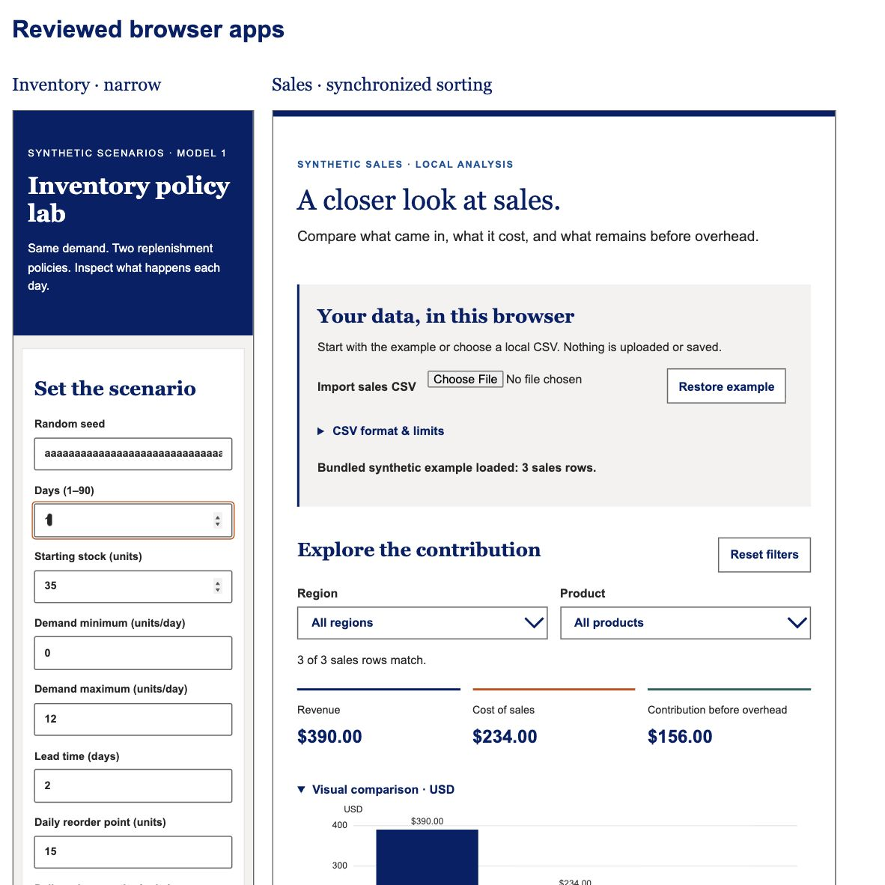

# Independent app review corrections

Seven confirmed findings corrected. Pricing had no confirmed defect and is unchanged; optional enhancements remain deferred. Plugin source, dependency versions and business models are unchanged. Current app sources live in the sibling inventory/ and sales/ snapshots. Earlier versions remain in repository commit fae631f and earlier local app commits; historical reports were retained rather than relabeled.

| App | Finding | Correction and observed regression |
| --- | --- | --- |
| Inventory | Long accepted seed overflows narrow page | Wrap unbroken seed text; actual 80-character seed at320px stays within page width. |
| Inventory | One-day line chart has no plotted mark | Render point symbols for one observation; test excludes legend symbols and verifies plot marks. |
| Inventory | Error disconnected from input | Visible label in message, aria-invalid, associated description, focus first invalid field and clear state after correction. Production lead0 focuses Lead time. |
| Inventory | Stock-limit hint implies a model cap | State explicitly that starting-stock/policy inputs are capped and resulting stock can exceed10,000. |
| Sales | Header and menu sorts disagree, filtering resets sort | Tabulator owns single-column sorting; menu derives options from columns and reflects current sort. Production Units ascending gives3,2,1; North preserves3,1; descending gives1,3. |
| Sales | Accepted large amounts lose a displayed cent | Format BigInt dollar/remainder parts; chart labels retain original cents. Actual81-row local import displays $80,000,000,000,000.01 on cards and chart labels. |
| Sales | CSV error row numbers misleading around blanks | Explicitly report data-record indices excluding header and blank records; multiline quoted fields count as one record. Actual malformed import reports record2 and preserves existing390/234/156 totals. |

Inventory final checkpoint445504c512ed6ea69e9c4eaa350db343cd85029c:14/14 browser groups passed. Sales final checkpointd5f8cff4f092a6da2a2336ecb3bf13833df422f6:32/32 passed. Saved visible browser result text is alongside this file. Four new sales groups test large signed/zero formatting, blank/multiline diagnostics and actual sorting/import/card/chart behavior. Inventory adds a combined real-UI regression group. A first draft marker assertion could count legend symbols, so it was strengthened before the final passing run.

Both production builds passed at their existing non-root local paths. Dependencies and relevant source/plan cleanliness were checked against final checkpoints; report-only commits followed. Existing bundle warnings remain approximately536kB inventory and979kB sales. No push, remote or publication. Repository checks and whitespace validation passed.

Browser automation's nested-frame clicks/keys were unreliable; UI regression scripts act within same-origin test frames and manual production checks use top-level tabs. Production layout was visually inspected, including a319px-wide inventory frame with319px scroll width. No physical-device or full screen-reader certification. The first malformed-file chooser attempt was accidentally denied; the user explicitly authorized retry and it succeeded. A later permission-service timeout was also resolved after renewed user authorization. No controls were bypassed.

Temporary correction servers and testing tabs were stopped after evidence capture. Restart procedures remain in each app's SETUP.md. These corrections do not establish live Pages deployment, Work routing or novice usability.
